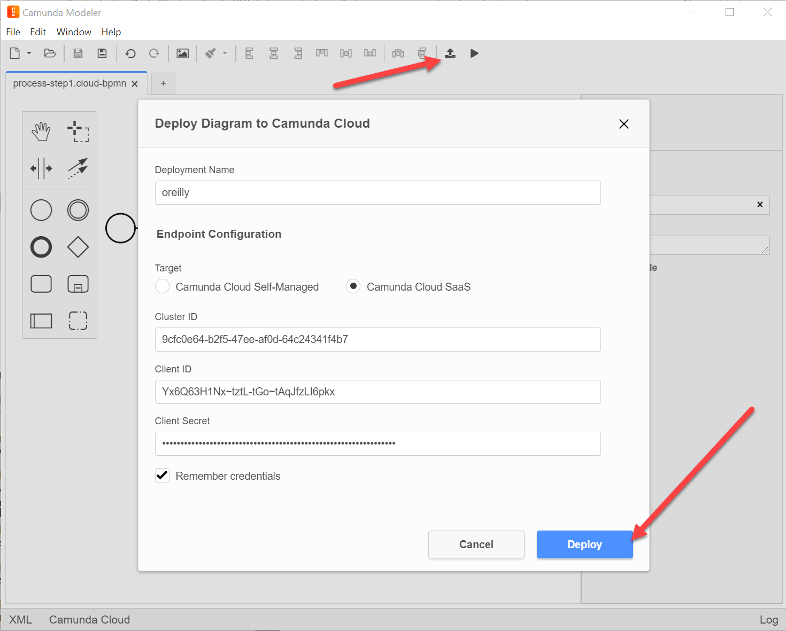

# Training "Process Automation in Modern Architectures"


# Lab 1: Execute Your First BPMN Process

You have three options to do this lab, depending on your level of interest:

1. **Install Camunda locally**: This needs either Docker or a Java runtime locally. Do this if you program regularly and love to fully understand what you are doing. This setup makes it easy to play around with the environment afterwards.
2. **Leverage a managed Camunda instance**: You will use a prepared environment in the cloud, but still can model and deploy yourself and write some code in Java, NodeJS or C# in a later step. Do this if you want to get your hands dirty at least a bit, but rely on a prepared environment to keep things simple.
3. **Watch the recording**: You can simply watch a walk through recording


## Option 1: Local Camunda Installation

### Step 1: Camunda Run

The easiest start to use Camunda is the so called "Camunda Run" distribution. This starts Camunda as an own server and allows you to connect to it via HTTP.

Please follow the Installation Guide in https://docs.camunda.org/manual/latest/user-guide/camunda-bpm-run/#starting-with-camunda-bpm-run. This also explains how to run it via docker, which is actually the easiest option:

```
docker run -d -p 8080:8080 camunda/camunda-bpm-platform:run-latest
```

If you have enterprise credentials (e.g. a trial) for Camunda, you can also run the enterprise edition:

```
docker login registry.camunda.cloud
docker run -d -p 8080:8080 registry.camunda.cloud/cambpm-ee/camunda-bpm-platform-ee:run-7.13.4
```

### Step 2: Camunda Modeler

Download the Camunda Modeler: https://camunda.com/download/modeler/. Follow the instructions.

### Step 3: Model the BPMN, deploy and run it

Model your first BPMN process using the Camunda Modeler. This contains a *user task*, an *XOR gateway* and a *service task*. If you struggle, you can find the recording below, that will walk you through it.


In order to configure the process model for execution

* Add an assignee to the user task (use the "demo" user):


* Add an auto generated form displayed in the UI that at least asks for the process variable `approved`:


* Configure the XOR gateway (decision) point by adding an expression to both outgoing sequence flows (arrows). One should be `#{approved}` and the other one `#{not approved}`


* Configure the service task to use the external task topic `celebrate`:


* Deploy the model to your local Camunda Run instance listening on port 8080:


* Start a new process instance from the modeler:


* Go to Camunda Cockpit via http://localhost:8080/camunda/app/cockpit/ (User: demo, Password: demo) and inspect the process instance

* Go to Camunda Tasklist via http://localhost:8080/camunda/app/tasklist/ (User: demo, Password: demo) and
  * add the simple filter via the link provided
  * show the task list
  * open the task
  * select a value for `àpproved` and complete the task

* You can start further process instances via tasklist

* You can also use CURL if you have it available on your system

```
curl \
-H "Content-Type: application/json" \
-X POST \
-d '{"variables":{"something" : {"value" : "Cake", "type": "String"}}}}' \
http://localhost:8080/engine-rest/process-definition/key/OReillyDemo/start
```


## Option 2: Managed Camunda

You will use the managed Camunda instance on this URL: https://oreilly-training-camunda-instance-hshwynfxmq-uc.a.run.app/


### Step 1: Camunda Modeler

Download the Camunda Modeler: https://camunda.com/download/modeler/. Follow the instructions.


### Step 2: Model the BPMN, deploy and run it

Model your first BPMN process using the Camunda Modeler. This contains a *user task*, an *XOR gateway* and a *service task*. If you struggle, you can find the recording below, that will walk you through it.


In order to configure the process model for execution

* Add an assignee to the user task (use the "demo" user):


* Add an auto generated form displayed in the UI that at least asks for the process variable `approved`:


* Configure the XOR gateway (decision) point by adding an expression to both outgoing sequence flows (arrows). One should be `#{approved}` and the other one `#{not approved}`


* Configure the service task to use an external task topic. You can basically name it as you like, but sue something you consider unique in the context of this training, e.g. your name and city or the like: `celebrate-Bernd-Berlin`:


* Adjust the process id, to avoid that different training attendees overwrite their models. Click somewhere in the blank area on your process model to do this. Use something you consider unique in the context of this training, e.g. your name and city or the like:


* Deploy the model to Camunda, therefor change the "REST Endpoint" to `https://oreilly-training-camunda-instance-hshwynfxmq-uc.a.run.app/`:



* Start a new process instance from the modeler:


* Go to Camunda Cockpit via https://oreilly-training-camunda-instance-hshwynfxmq-uc.a.run.app/camunda/app/cockpit/ (User: demo, Password: demo) and inspect the process instance

* Go to Camunda Tasklist via https://oreilly-training-camunda-instance-hshwynfxmq-uc.a.run.app/camunda/app/tasklist/ (User: demo, Password: demo) and
  * add the simple filter via the link provided
  * show the task list
  * open the task
  * select a value for `àpproved` and complete the task

* You can start further process instances via tasklist

* You can also use CURL if you have it available on your system (adjust the `process definition id` to the one you set!):

```
curl \
-H "Content-Type: application/json" \
-X POST \
-d '{"variables":{"something" : {"value" : "Cake", "type": "String"}}}}' \
https://oreilly-training-camunda-instance-hshwynfxmq-uc.a.run.app/engine-rest/process-definition/key/OReillyDemo-Bernd6352/start
```

## Option 3: Watch Recording


<a href="http://www.youtube.com/watch?feature=player_embedded&v=XimowIZLWD8" target="_blank"></a>


# Lab 2: Implement a Service Task

You have multiple options to implement the behavior behind the service task:

1. Java Worker: [demo/worker-java/](demo/worker-java/)
2. NodeJS Worker: [demo/worker-nodejs/](demo/worker-nodejs/)
3. C# Worker: [demo/worker-csharp/](demo/worker-csharp/)
4. Plain REST

## Option 1: Java Worker
## Option 2: NodeJs Worker
## Option 3: C# Worker
## Option 4: Plain REST
